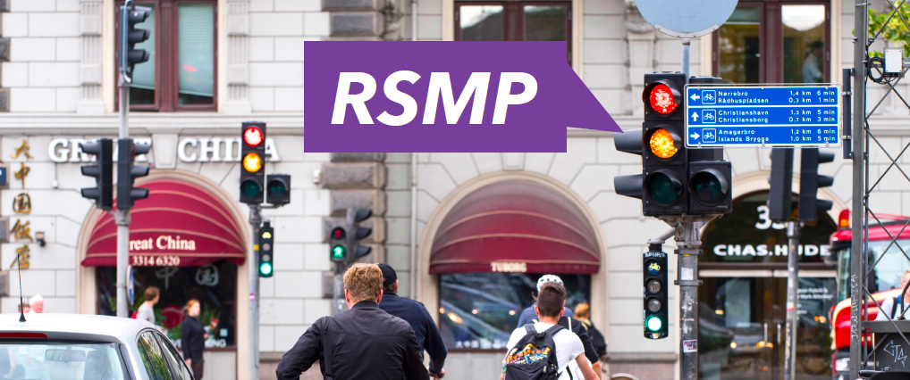

---
# You don't need to edit this file, it's empty on purpose.
# Edit theme's home layout instead if you wanna make some changes
# See: https://jekyllrb.com/docs/themes/#overriding-theme-defaults
layout: page
---

**RSMP** er en åben, moderne, letvægts og fleksibel protokol til kommunikation mellem trafiksignaler, andet veksideudstyr og trafikledelsessystemer.

**RSMP Nordic** er en organisation / et samarbejde under etablering Trafikverket i Sverige, Vejdirektoratet i Sverige, Stockholms Stad samt Københavns Kommune. Formålet er at koordinere udviklingen af RSMP og promovere standarden i norden. Alle interesserede partnere er velkommen til at deltage i samarbejdet.

[Læs mere](/about)