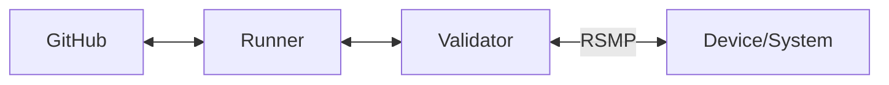

# RSMP Test Hub
The RSMP Test Hub is used for continuous validation of RSMP compliance of equipment and systems. Results can optionally be published at the [compliance page]().

You should not test device/system located on street or in production, because testing will send commands, raise alarms, etc. which can interfere with normal operation and cause unsafe situation.

## Overview
The RSMP Test Hub uses GitHub Actions to run tests. 



You install GitHub Runner on a Linux server (or docker container). The runner must be able to contact GitHub and your device/system.

Detailed instructions for connecting your equipment or system to the RSMP test hub is shown below. Please contact the [secretariat]() to receive a unique token for your equipment/system.


When testing is initiated on GitHub, the runner installs all required software, including Ruby, Ruby gems and the RSMP Validator. The runner then runs the Validator, which connects to the device/system using RSMP. Testing then involves exchanging RSMP message while validating messages structure and flow.

The test results are then reported back to GitHub.

Finally, we optionally show your device/system with a validation flag at our [compliance page]().

Tests are run every night and also whenever there are commits to the Validator repo. We recommend you have your device/system permamently setup for testing, to always show up-to-date test results.

The test hub can run tests on a matrix of core and SXL versions. We recommend running on the widest possible range of versions.

## Getting Started
### Installing GitHub Runner
The following instructions are provided as a guideline, but could change.

Check the [GitHub runner docs](https://docs.github.com/en/actions/hosting-your-own-runners) for the latests documentation.

Check the [latest version of the GitHub Runner](https://github.com/actions/runner/releases) and adjust the instructions accordingly.

You must install the Github Runner on a Linux system. The following instructions assume an x64 architecture.

The instructions include a unique token. To receive a unique token for your device/equipment, please contact the [Secretariat]().

First download and install the runner:
```
# Create a folder
$ mkdir actions-runner && cd actions-runner
# Download the latest runner package
$ curl -o actions-runner-linux-x64-2.320.0.tar.gz -L https://github.com/actions/runner/releases/download/v2.320.0/actions-runner-linux-x64-2.320.0.tar.gz
# Optional: Validate the hash
$ echo "93ac1b7ce743ee85b5d386f5c1787385ef07b3d7c728ff66ce0d3813d5f46900 actions-runner-linux-x64-2.320.0.tar.gz" | shasum -a 256 -c
# Extract the installer
$ tar xzf ./actions-runner-linux-x64-2.320.0.tar.gz
```

And then configure and run it:
```
# Create the runner and start the configuration experience
# <token> must be replace with a unique token provided by RSMP Nordic.
$ ./config.sh --url https://github.com/rsmp-nordic/rsmp_validator --token <token>
# Last step, run it!
$ ./run.sh
```

### Test Config
You need to create a test config for the device to be tested. The config describes what components and elements to tests. For example, a config for a traffic light controller lists signal plans, inputs, etc. to use when testing. It also defines various timeouts.

You should use an [existing configuration](https://github.com/rsmp-nordic/rsmp_validator/tree/main/config) as a starting point, and modify it to fit your device.

You can run the RSMP Validator locally to check  that your config is correct.

When the config is ready, please open open a [Pull Request](https://github.com/rsmp-nordic/rsmp_validator/pulls) in the RSMP Validator repository with the file.

### Workflow file
RSMP core members will create a GitHub Actions workflow file responsible for running the RSMP Validator on your runner machine, using your test config and communicating with your device.

To create the workflow file, we need the following information from you:

- what is the manyfacturer and model name of the device?
- what core versions does the device support?
- what sxl version is the device using?

Once the config and workflow files are merged, tests will run daily according to the schedule define in the workflow file. The default is nightly at 22:00 CET, as well as when relevant pull requests are opened.
